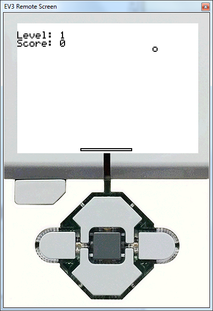

# MSE 110: Exercise 1 - Pong

This Lego Mindstorms EV3 ROBOTC program plays a game of one-person pong using the left and right keys on the Mindstorms brick.

The player has 3 lives; when all 3 lives run out, they lose the game and are returned to the home screen. When the score reaches a multiple of 3, the level and speed of the ball increase.

## Gameplay

