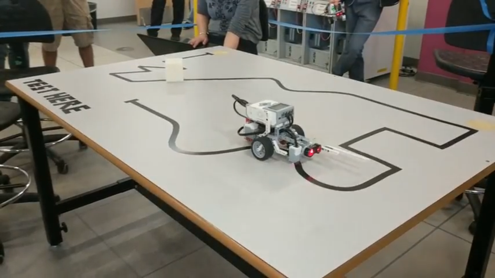

# MSE 110: Project 1 - Line Follower

This Lego Mindstorms EV3 ROBOTC program guides the robot along a black line on a white surface by following the right edge of the line.

An alternative program is provided which uses a PID (proportional-integral-derivative) controller.

## Videos

### Test Course

### Demo

