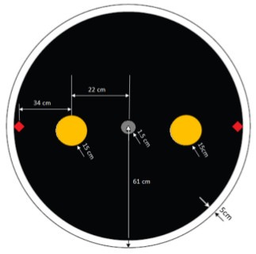
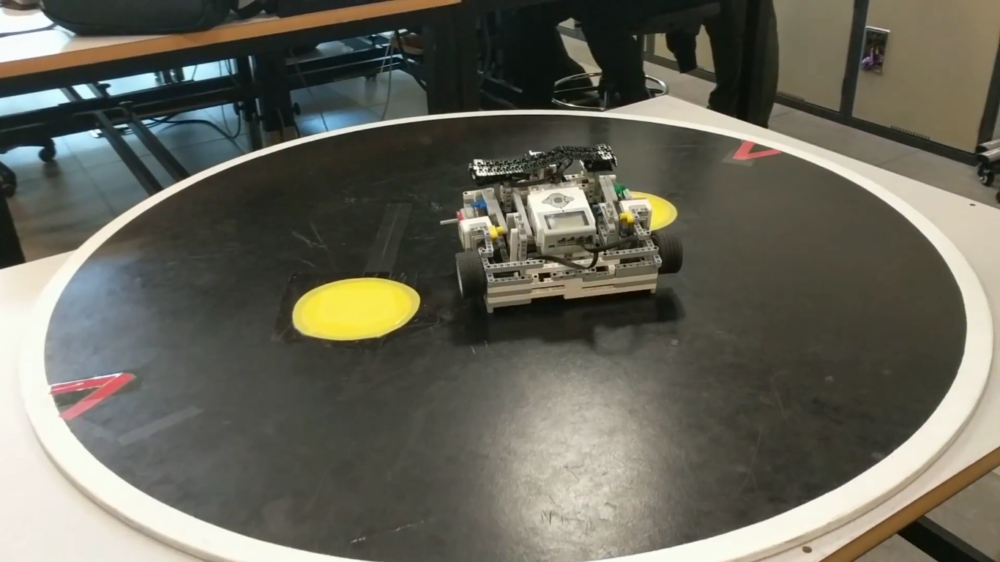

# MSE 110: Project 2 - Combat

This Lego Mindstorms EV3 ROBOTC program moves a robot around a black circular sumo ring, outlined with a white ring and containing yellow circles. The robot moves around the course with the goal of removing its opponent from the ring.

## Field Diagram

## Video (Assessment)

