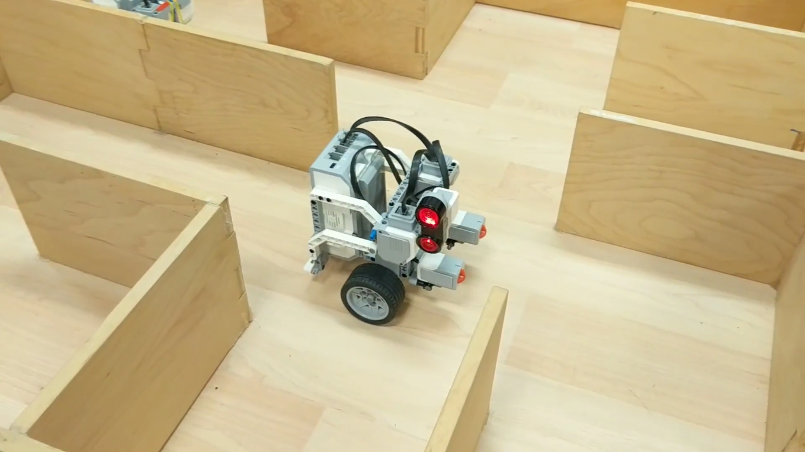
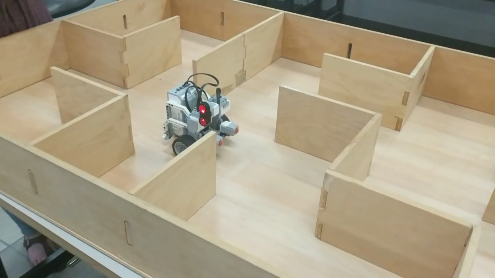

# MSE 110: Project 4 - Maze Navigator

This Lego Mindstorms EV3 ROBOTC program navigates a robot along a maze to a destination coordinate, then returns to the original coordinate using the optimal path.

The right-hand rule is used to navigate the maze. The maze is composed of square cells.

## Video (Test Course)

## Video (Demo)

